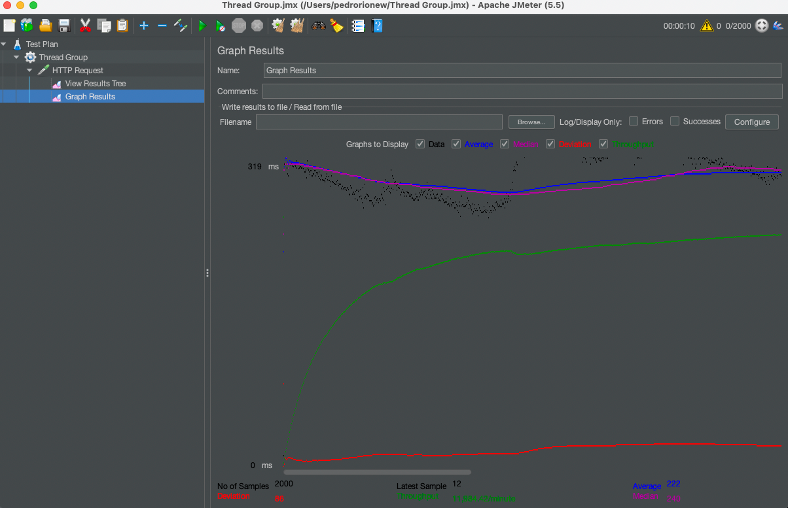

# README

### How run the project?

In the root directory there are two scripts:
* build.sh
* run.sh

The build script does not need any parameters and will install and use the correct version of ruby for running the app as well as installing all the dependencies and running the tests.
The run script should be executed with a parameter with the path to the input file to be used:
> ./run.sh path/to/file/input_file.txt

After that the app should be running on http://localhost:3000/

### How does the system work?

On boot:
* The input file is processed line by line and partitioned into smaller batches. The size of these batches is controlled by an environment variable PARTITION_SIZE - the value represents the number of lines each partition will have.
* A map is built with all the partitions file names and indexes to later be consulted each time the server receives a request.
* A variable containing the total number of lines of the input file is created to later be used to verify if the request index is out of range.

On runtime:
* The Lines Controller is responsible for handling the requests
* A bad request is raised when the index is not a valid positive integer, the first valid index is 0.
* The request index is checked against the total index value and a 413 is raised if the value is out of range.
* If the index is valid the line is fetched from the Line Repository that obtains the partition where the requested index is, and processes it line by line until the requested index is reached.
### How will your system perform with a 1 GB file? a 10 GB file? a 100 GB file?

File size does not impact application performance significantly, since the file is only processed before the application is running the only impact is on boot time, before the server is launched. Since the file is partitioned and stored in a directory inside a data folder the direct impact is on storage.

### How will your system perform with 100 users? 10000 users? 1000000 users?

Using Jmeter I was able run some quick performance and load tests. I simulated a peak of 2000 different users making the same request in a ramp up period of 10 seconds. The results were an average response time of ~200 ms with no requests failing reaching a throughput of around 12k requests/min. By lowering the partition size we could see improvements on the rate limit with the trade-off of the batch map object increasing thus occupying more memory.

Rails out of the box allows for various operations to be performed at the same time, using the threaded web server Puma we can control how many workers and threads the application can have running.
For even higher usage and throughput I would try to scale the application horizontally by having more instances of the server running at the same time, implementing a load balancer + API Gateway to distribute the requests and have more control over allowed rate limit.

### Dependencies, Environment Variables and Documentation

The app was based in Ruby with Rails with most of the dependencies and gems being rails native. Rails framework provides a good out of the box configuration for the web application and the only gem I added externally was the **dotenv-rails** to manage the environment variables.

The environment variables are:
* **PARTITION_SIZE** - The number of lines each partition will have 
* **DATA_DIRECTORY** - The directory in which the partition files will be stored and accessed
* **FILENAME** - The name of the input file to be used, must be passed as a parameter of the run.sh script

References:
* https://tjay.dev/howto-working-efficiently-with-large-files-in-ruby/
* https://www.guru99.com/jmeter-performance-testing.html

### Improvements

Overall I spent around 5~6 hours on the project and I am happy with the result. However:
* The logic used in processing the file is not the cleanest and the most efficient and I think that it can be a bit confusing.
* Partitioning over the number of lines could lead to uneven partitions and that could lead to unexpected behaviour. In my tests I only used files with the same line size but in reality lines can differ in size.
* Storage of the partitions in the repository itself is not the best for larger files, I would have liked to be able to store them in external storage (like an S3 bucket).